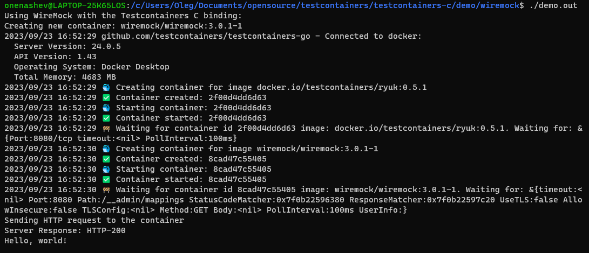

# Testcontainers for C/C+ and other native languages

    <!--<a href="https://wiremock.org" target="_blank">-->
        
    <!--</a>-->

> **WARNING**: This is a prototype.
> There is a lot to do before it can be distributed and used in production,
> see the GitHub Issues.
> The plan is to build a proper distributable with a CMake proper structure,
> have proper Cpp Unit integrations,
> and have the library published to Conan.
> A feasible level of feature parity with Testcontainers Go is needed too,
> hence a lot of wrapper coding.
> Contributions are welcome!

This is not a standalone [Testcontainers](https://testcontainers.org/) engine,
but a C-style shared library adapter for native languages like C/C++, D, Lua, Swift, etc.
It is a MVP SDK that can be later extended for the languages.

The project is based on [Testcontainers for Go](https://golang.testcontainers.org/)
which is one of the most powerful Testcontainers implementations.

## Sample output

This is how a very simple run without a test framework may look like.

## Documentation

Coming soon: guidelines, specs and code documentation. Check out the examples for now.

## Usage in C/C++

See [the examples and demos](./demo/)

## Usage in other languages

TL;DR: You get the C header file, a shared library object or a DLL file from the
[Testcontainers C](./testcontainers-c/) module,
Then, you know the drill.
Feel free to contribute examples or SDKs for the languages!

## Modules

- [WireMock](./modules/wiremock/)

> **NOTE:** Some modules are stored in this repository for demo and prototyping purposes.
> If you develop new modules, once `vcpkg` or `Conan` packaging is implemented for Testcontainers C,
> you might want to develop your module in a standalone repository instead.

## Examples and Demos

- [Using the WireMock module](./demo/wiremock/)

## Credits

Using a complex Golang framework from C/C++ is not trivial.
Neither the CMake files are.
This project would not succeed without many quality articles
and help from the community.

Kudos to:

- All Testcontainers, Golang C-Shared build mode, CGO and WireMock contributors!
- [Manuel de la Peña](https://github.com/mdelapenya) for maintaining [Testcontainers for Go](https://github.com/testcontainers/testcontainers-go) and answering bizarre questions about the implementations `:-)`
- [Vladimir Vivien](https://github.com/vladimirvivien) for
  [Calling Go Functions from Other Languages using C Shared Libraries](https://github.com/vladimirvivien/go-cshared-examples)
- [Ben McClelland](https://twitter.com/hpc_ben) for
   [An Adventure into CGO - Calling Go code with C](https://medium.com/@ben.mcclelland/an-adventure-into-cgo-calling-go-code-with-c-b20aa6637e75)
- [Insu Jang](https://github.com/insujang) for
  [Implementing Kubernetes C++ Client Library using Go Client Library](https://insujang.github.io/2019-11-28/implementing-kubernetes-cpp-client-library)
- Infinite number of StackOverflow contributors

## Read More

- [Testcontainers](https://testcontainers.org/)
- [WireMock and Testcontainers](https://wiremock.org/docs/solutions/testcontainers/)
- [Testcontainers Modules](https://testcontainers.com/modules)
- [WireMock modules for Testcontainers](https://testcontainers.com/modules/wiremock/)
